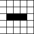
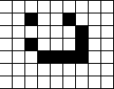

# Conway's Game of Life

This project showcases **Conway's Game of Life**, a zero-player cellular automaton simulation, implemented in Java. Create, edit, and watch patterns evolve over time according to simple yet fascinating rules!

## Features

- Interactive grid for designing initial cell configurations.
- Adjustable simulation speed using a slider.
- Options to start, pause, and clear the simulation for experimentation.
- Intuitive color scheme: **Black** for active cells, **White** for inactive cells.
- Lightweight and easy to run with minimal setup.

## How to Run

1. **Install the latest version of Java Runtime Environment (JRE)** if it's not already installed. You can download it [here](https://www.java.com/en/download/).
2. Clone this repository to your local machine:
   ```bash
   git clone https://github.com/cc0407/Conways-Game-of-Life.git
   ```
3. Navigate to the project directory:
   ```bash
   cd Conways-Game-of-Life
   ```
4. Run the `.jar` file:
   ```bash
   java -jar Conways-Game-of-Life.jar
   ```
   > **Note:** The `Conways-Game-of-Life.jar` file **must remain in the same directory** as the accompanying files for proper functionality.

## Gameplay Instructions

Not familiar with Conway's Game of Life? Check out the [Wikipedia page](https://en.wikipedia.org/wiki/Conway%27s_Game_of_Life) for an overview of the rules.

### Getting Started

1. **Set up the grid**:
   - Click on any cell to toggle its state between active (black) and inactive (white).
   - Design any initial pattern you like.
2. **Start the simulation**:
   - Press the **Start** button to begin the simulation.
   - Watch the grid evolve based on Conway's rules:
     - Any live cell with 2 or 3 neighbors survives.
     - Any dead cell with exactly 3 live neighbors becomes a live cell.
     - All other live cells die in the next generation.
3. **Adjust the simulation**:
   - Use the speed slider to increase or decrease the evolution rate.
4. **Reset as needed**:
   - Press the **Clear** button to reset the grid and start fresh.

## Example Patterns to Try

Here are some classic patterns you can set up on the grid:

-   
   **Glider**: A small pattern that moves diagonally across the grid.
-   
   **Blinker**: A simple oscillator that alternates between two states.
-   
   **Spaceship**: A pattern that moves horizontally or vertically across the grid.

## Requirements

- Java Runtime Environment (version 8 or later).

## Known Issues

- The `.jar` file must remain in the same directory as its accompanying files; otherwise, the program may not function as expected.

## Contributing

Contributions are welcome! If you have ideas for improvements or new features, feel free to fork the repository and submit a pull request.

## License

This project is licensed under the [MIT License](LICENSE).
